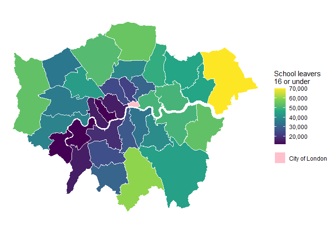

School leavers in London
================
Sandra Jurela
2022-12-05

### Setting up the programming environment

``` r
# loading packages
library(tidyverse)
library(sf)
```

### Reading the datasets

``` r
london_sf <- read_sf("data/london_boroughs")

education_data <- read_csv("data/age-when-completed-education.csv")
```

``` r
london_sf %>% head()
```

    ## Simple feature collection with 6 features and 1 field
    ## Geometry type: MULTIPOLYGON
    ## Dimension:     XY
    ## Bounding box:  xmin: 515484.9 ymin: 156480.8 xmax: 554087.9 ymax: 198355.2
    ## Projected CRS: OSGB36 / British National Grid
    ## # A tibble: 6 × 2
    ##   lad11nm                                                               geometry
    ##   <chr>                                                       <MULTIPOLYGON [m]>
    ## 1 Barking and Dagenham (((550345.1 183322.2, 550277.8 183178.6, 550249.6 183138…
    ## 2 Barnet               (((523954.5 185541.5, 523906.2 185606.7, 523879.7 185640…
    ## 3 Bexley               (((547214 170356.6, 547047.2 170329.9, 546752.6 170419.6…
    ## 4 Brent                (((523851.7 182672.2, 523851.1 182668.6, 523850.3 182509…
    ## 5 Bromley              (((545575.3 157014.6, 545513.3 156944.4, 545237.4 156802…
    ## 6 Camden               (((530257.6 181150.3, 530233.5 181128, 530084 181009.6, …

``` r
education_data %>% head(10)
```

    ## # A tibble: 10 × 4
    ##    code      area                 age_group          value
    ##    <chr>     <chr>                <chr>              <dbl>
    ##  1 E09000001 City of London       16 or under           NA
    ##  2 E09000001 City of London       17-19                 NA
    ##  3 E09000001 City of London       20-23                 NA
    ##  4 E09000001 City of London       24+                   NA
    ##  5 E09000001 City of London       Still in education    NA
    ##  6 E09000002 Barking and Dagenham 16 or under        46000
    ##  7 E09000002 Barking and Dagenham 17-19              42000
    ##  8 E09000002 Barking and Dagenham 20-23              31000
    ##  9 E09000002 Barking and Dagenham 24+                11000
    ## 10 E09000002 Barking and Dagenham Still in education  9000

### Data wrangling

``` r
london_school_leavers_sf <- london_sf %>% 
  # Joining education data to the sf object
  left_join(education_data, by = c("lad11nm" = "area")) %>% 
  # filtering the age group of interest
  filter(age_group == "16 or under")

london_school_leavers_sf %>% head()
```

    ## Simple feature collection with 6 features and 4 fields
    ## Geometry type: MULTIPOLYGON
    ## Dimension:     XY
    ## Bounding box:  xmin: 515484.9 ymin: 156480.8 xmax: 554087.9 ymax: 198355.2
    ## Projected CRS: OSGB36 / British National Grid
    ## # A tibble: 6 × 5
    ##   lad11nm                                           geometry code  age_g…¹ value
    ##   <chr>                                   <MULTIPOLYGON [m]> <chr> <chr>   <dbl>
    ## 1 Barking and Dagenham (((550345.1 183322.2, 550277.8 18317… E090… 16 or … 46000
    ## 2 Barnet               (((523954.5 185541.5, 523906.2 18560… E090… 16 or … 52000
    ## 3 Bexley               (((547214 170356.6, 547047.2 170329.… E090… 16 or … 54000
    ## 4 Brent                (((523851.7 182672.2, 523851.1 18266… E090… 16 or … 44000
    ## 5 Bromley              (((545575.3 157014.6, 545513.3 15694… E090… 16 or … 45000
    ## 6 Camden               (((530257.6 181150.3, 530233.5 18112… E090… 16 or … 25000
    ## # … with abbreviated variable name ¹​age_group

### Data visualization

``` r
ggplot() +
  geom_sf(data = london_school_leavers_sf,
          aes(fill = value, shape = "City of London"),
          color = "white",
          size = 0.2) +
  scale_fill_viridis_c(labels = scales::number_format(big.mark = ","),
                       name = "School leavers\n16 or under",
                       na.value = "pink") +
  guides(shape = guide_legend(override.aes = list(fill = "pink"),
                              title = NULL,
                              order = 2),
         fill = guide_colorbar(order = 1)) +
  theme_void()
```


